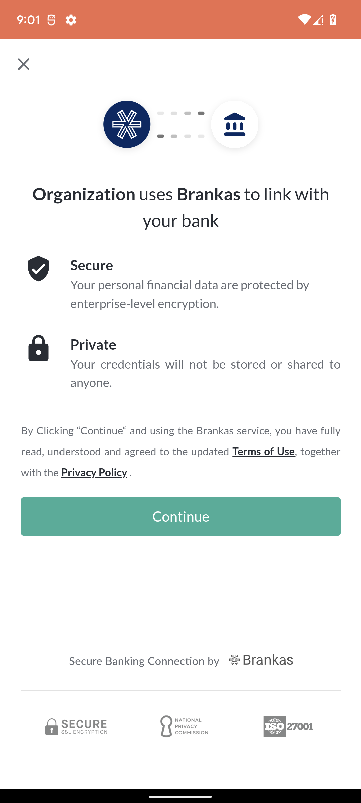
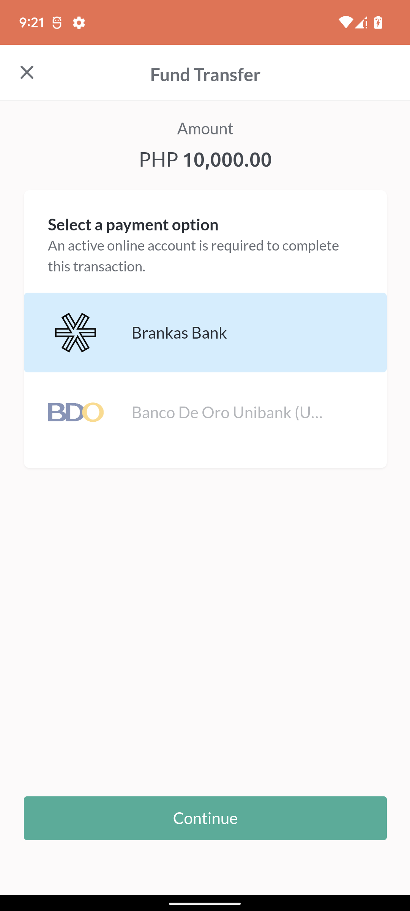
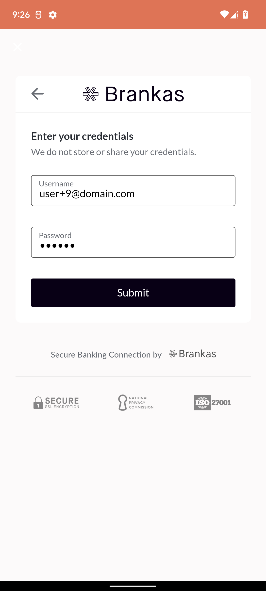
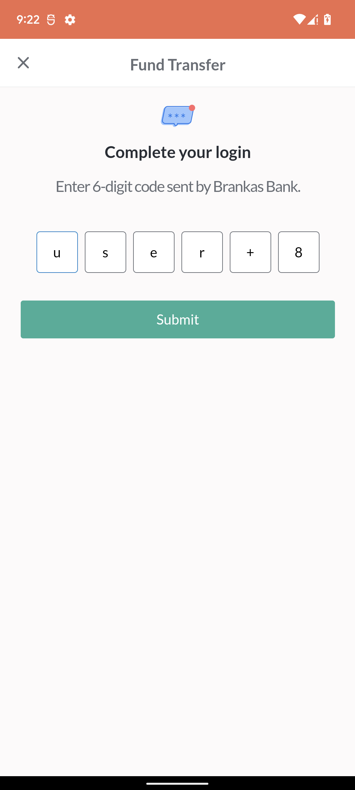
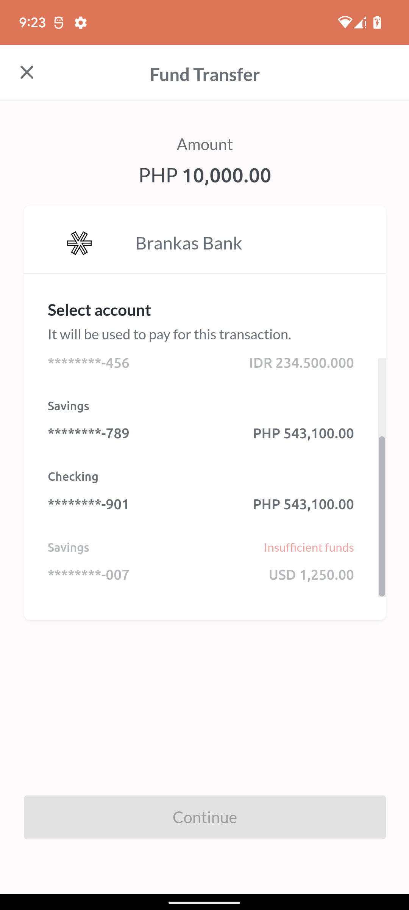
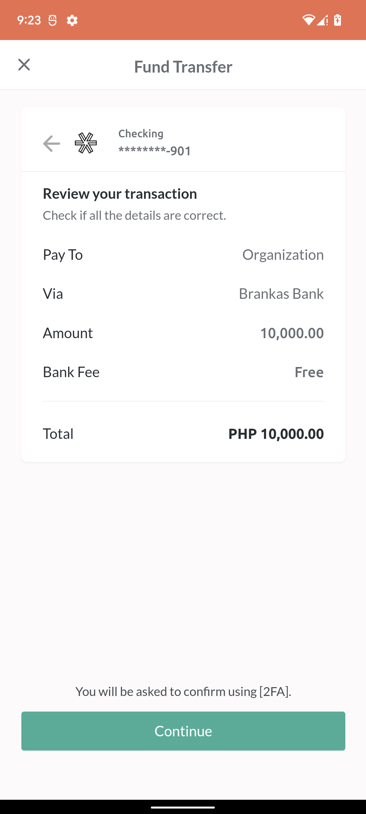
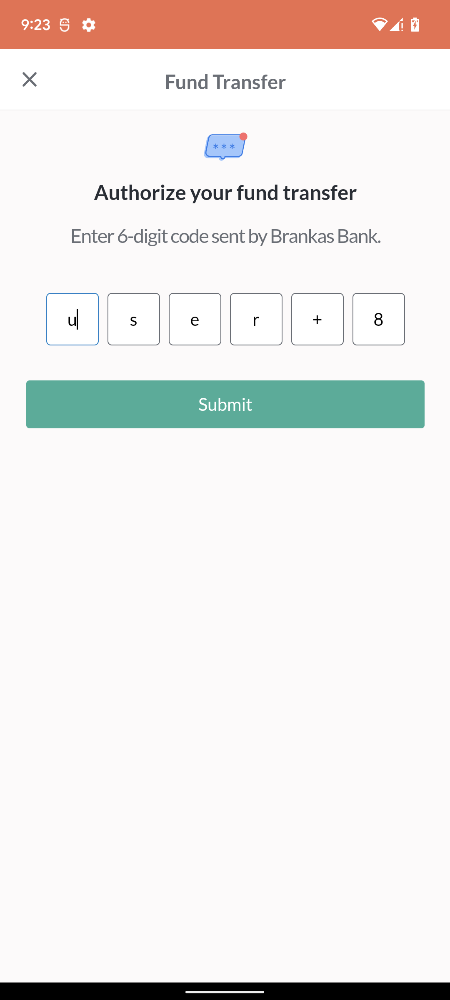
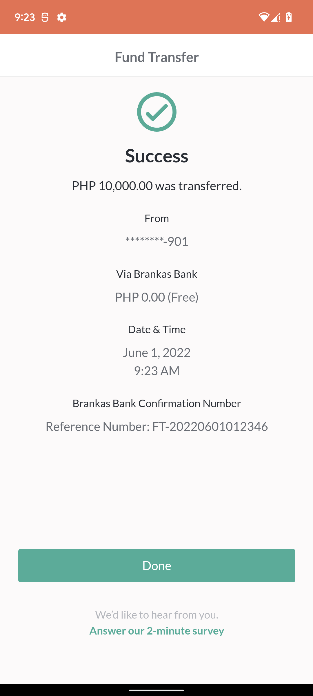

# Direct Tap SDK for Android
***
*Version:* 4.1.0
***


## Table of Contents

  1. [About SDK](#about-sdk)
  2. [Minimum Requirements](#minimum-requirements)
  3. [Installation](#installation)
  4. [Initialization](#initialization)
  5. [Usage](#usage)
  6. [App Tracking and Privacy Changes](#app-tracking-privacy) 

***

<a name="about-sdk">
## About SDK
</a>

### What is Direct Tap SDK?
- **DirectTap SDK** is a development kit used to launch Tap Web Application inside an embedded WebView via **Direct API** (Application Programming Interface) for **Fund Transfer**. 
- This kit helps mobile developers to integrate with Brankas Direct API Services with less setup needed and code implementation. 
- The SDK provides list of enabled banks available for fund transfer including Fund Transfer Fee and Limit for each bank
- The SDK also provides the **Transaction** object after bank transfer has been successful or has failed

### Benefits of Using Direct Tap SDK
- **The SDK provides everything that is needed**<br/> No need to setup HTTPURLConnection or any similar third-party library. Everything is already built within the SDK. Just call the appropriate functions and the needed data will be returned.
- **The SDK provides User Interface**<br/>No need to create a WebView or launch an external Mobile Web Browser. The SDK already provides an embedded WebView wherein built-in functions are done to detect successful or failed transactions
- **The SDK provides freedom and flexibility.**<br/>The developer has the option not to use the embedded WebView and create his own: the checkout URL can be used.<br/>The embedded WebView can be launched via another **Activity** or be embedded inside a **Fragment**
- **The SDK provides convenience.**<br/>The needed API Services are called sequentially and polling of retrieval is handled internally. The Balance Account List object will be returned automatically after Tap Web Application Session.
- **The SDK provides greater speed.**<br/>The SDK uses gRPC (Remote Procedure Call) mechanism to communicate with the API Services faster. Using gRPC is roughly 7 times faster than REST (Representational State Transfer) when receiving data and roughly 10 times faster when sending data

### How to Use 'Tap'?
- Just follow these easy steps to perform **Fund Transfer**
1. Click **Continue** to accept terms and conditions regarding Privacy Policy in the Consent Page<br/><br/><br/><br/>
2. Select the desired bank in the Bank Selector Page and click **Continue**<br/><br/><br/><br/>
3. Enter the login credentials and click **Submit** <br/><br/><br/><br/>
4. Enter the OTP (One-time Password) and click **Submit** <br/><br/><br/><br/>
5. Select the desired bank account to be used as the source of funds and click **Continue** <br/><br/><br/><br/>
6. Review and check if the transaction to be done is correct and click **Continue** <br/><br/><br/><br/>
7. Enter the OTP (One-time Password) for fund transfer and click **Submit** <br/><br/><br/><br/>
8. Wait until the fund transfer is finished. Success Page will be shown subsequently.<br/><br/><br/><br/>
 
<a name="minimum-requirements">
## Minimum Requirements
</a>

1. **Android Studio 3.0** but preferably the latest version
2. Minimum Android SDK: **API 21** or **Android 5.0**

## Installation

This set of instructions assumes that the IDE being used is Android Studio

1. In your project build.gradle, ensure to add the URL of the repository under maven. Here is a sample:
	```
	allprojects {
    	repositories {
        		maven {
            		url = "https://maven.pkg.github.com/brankas/core-sdk-android"
            		credentials {
                			username = ""
                			password = ""
            		}
        		}
    	}
}
	```
**NOTE: You can use any GitHub Account in filling up the credentials**

2. In your app build.gradle file, add this line inside the dependencies configuration: **implementation "com.brankas.tap:direct-tap:4.1.0"** to set the SDK as a dependency for the application. This should look like:
	````gradle
	dependencies {
    	implementation "com.brankas.tap:direct-tap:4.1.0"
	}
	````

3. Inside the the same dependencies configuration, insert the following lines to enable gRPC Connections which are needed by the SDK. Also, include RxJava for asynchronous listening to the results. **Do not forget to include compileOptions and kotlinOptions to use Java 8**

	```gradle
	dependencies {
 		implementation 'com.google.protobuf:protobuf-javalite:3.20.0'
    		implementation 'io.grpc:grpc-okhttp:1.45.1'
    		implementation('io.grpc:grpc-protobuf-lite:1.45.1') {
        			exclude group: 'com.google.protobuf'
    		}
    		implementation 'io.grpc:grpc-stub:1.45.1'
			implementation 'io.reactivex.rxjava3:rxjava:3.0.6'
    		implementation 'io.reactivex.rxjava3:rxandroid:3.0.0'
			//implementation "org.jetbrains.kotlinx:kotlinx-coroutines-rx2:$kotlin_coroutines_version"
			implementation 'org.jetbrains.kotlinx:kotlinx-serialization-json:1.3.2'
	}

	compileOptions {
        		sourceCompatibility JavaVersion.VERSION_1_8
        		targetCompatibility JavaVersion.VERSION_1_8
    	}

    	kotlinOptions {
        		jvmTarget = "1.8"
    	}
	```
**NOTE: To mix coroutines and RxJava in the same project, include the optional dependency commented out**

4. In the plugins section, add these:

	````gradle
plugins {
    	id 'com.android.application'
    	id 'kotlin-android'
    	id 'kotlin-parcelize'
    	id 'org.jetbrains.kotlin.plugin.serialization' version '1.6.10'
}
	````

5. Add the permission **android.permission.INTERNET** in your **AndroidManifest.xml** file to allow your application to access Internet, which is required to use Tap API Services.

    ```xml
    <uses-permission android:name="android.permission.INTERNET" />
    ```
    
## Initialization

1. Call the initialize function from the DirectTapSDK and pass the context and api key provided by Brankas.<br/><br/>**Java:**

	```java

	import as.brank.sdk.tap.direct.DirectTapSDK;

	DirectTapSDK.INSTANCE.initialize(context, apiKey, null, false);

	```

	**Kotlin:**

	```kotlin

	import `as`.brank.sdk.tap.direct.DirectTapSDK

	DirectTapSDK.initialize(context, apiKey, null, false)

	```
***NOTE:*** To use the **Sandbox** environment, set the optional **isDebug** option to **true**

2. The checkout function can now be called once the initialize function has been called.

## Usage

The SDK has a checkout function wherein it responds with a redirect url used to launch the Tap web application. An option is given either to use the url manually (via **retrieveCheckoutURL()** function) or let the SDK launch it through its internal WebView.

In order to use the checkout function, a **DirectTapRequest** is needed to be created and be passed. It has the following details:

1. **sourceAccount** - the account to be used as a sender of money for bank transfer. It consists of **BankCode** (code for a specific bank) and **Country** (country of origin)
<br/><br/>***NOTE:*** If **bankCode** is set to **null**, an internal bank selection screen will be shown inside Tap web application. If it has been filled up, that bank would automatically be selected instead.

2. **destinationAccountId** - the ID of the registered account of the receiver of money for bank transfer. This is provided by Brankas. Each registered account has a corresponding ID.

3. **amount** - the amount of money to be transferred. It consists of **Currency** (the currency of the money to be transferred) and the amount itself in centavos (e.g. If Php 1 would have been transferred, "100" should be passed)

4. **memo** - the note or description attached to the bank transfer

5. **customer** - pertains to the details of the sender of money. It consists of **firstName**, **lastName**, **email** and **mobileNumber**

6. **referenceId**

7. **client** - pertains to the customizations in the Tap Web Application and callback url once bank transfer is finished. It consists of **displayName** (name in the header to be shown in the Tap Web Application), **logoUrl** (URL of the logo to be shown), **returnUrl** (URL where Tap would be redirecting after bank transfer is finished), **failUrl** (optional URL where Tap would be redirecting if bank transfer has failed), **statementRetrieval** (optional Boolean that shows the list of statements after bank transfer is finished; its default value is false), **language** (optional enum that changes the language being used within Tap Web App)

8. **dismissalDialog** - pertains to the showing of alert dialog when closing the WebView. It consists of **message**, **positiveButtonText** and **negativeButtonText**. Just set this value to null to remove the alert dialog when closing the application.

9. **expiryDate** -  refers to the expiry time of the created invoice, default value is null

10. **uniqueAmount** -  refers to the enabling of centavo reconciliation workaround logic, default value is UniqueAmount.NONE

Here is a sample on how to use it and call:
	<br/><br/>**Java:**

```java
import as.brank.sdk.core.CoreError;
import as.brank.sdk.tap.CoreListener;
import as.brank.sdk.tap.direct.DirectTapSDK;
import tap.model.direct.*;
import tap.model.Currency;
import tap.request.direct.DirectTapRequest;
import tap.model.Reference;
import tap.model.direct.Transaction;
import tap.model.BankCode;
import tap.model.Country;
import tap.model.DismissalDialog;
import tap.model.Currency;

DirectTapSDK.INSTANCE.checkout(activity,
        new DirectTapRequest.Builder()
        .sourceAccount(new Account(null,Country.PH))
        .destinationAccountId("2149bhds-bb56-11rt-acdd-86667t74b165")
        .amount(new Amount(Currency.PHP,"10000"))
        .memo("Sample Bank Transfer")
        .customer(new Customer("Owner","Name","sample@brankas.com","63"))
        .client(new Client("Sample Client",null,"www.google.com"))
        .referenceId("sample-reference").build(),
        new CoreListener<String> {
		@Override
		public void onResult(@Nullable String str,@Nullable CoreError coreError){
        		if(coreError!=null)
        			System.out.println("Error: "+coreError.getErrorMessage());
        	}
        }, 1000);

// Used to retrieve the result from Tap Web Application
@Override
void onActivityResult(int requestCode,int resultCode,Intent data){
	super.onActivityResult(requestCode,resultCode,data);

     	if(requestCode==1000){
            	// Transaction is successful
            	if(resultCode==RESULT_OK){
            		// Retrieve transaction
            		Transaction transaction = data.getParcelableExtra<Reference<Transaction>>(DirectTapSDK.TRANSACTION).get();
        		System.out.println("TRANSACTION ID: "+transaction.getId());
        	}
        }
}
````

<br/><br/> **Kotlin:**

```kotlin
import `as`.brank.sdk.core.CoreError
import `as`.brank.sdk.tap.CoreListener
import `as`.brank.sdk.tap.direct.DirectTapSDK
import tap.model.direct.*;
import tap.model.Currency;
import tap.request.direct.DirectTapRequest;
import tap.model.Reference;
import tap.model.direct.Transaction;
import tap.model.BankCode;
import tap.model.Country;
import tap.model.DismissalDialog;
import tap.model.Currency;

DirectTapSDK.checkout(activity, 
	DirectTapRequest.Builder()
        	.sourceAccount(Account(null, Country.PH))
        	.destinationAccountId("2149bhds-bb56-11rt-acdd-86667t74b165")
        	.amount(Amount(Currency.PHP, "10000"))
        	.memo("Sample Bank Transfer")
        	.customer(Customer("Owner", "Name", "sample@brankas.com", "63"))
        	.client(Client("Sample Client", null, "www.google.com"))
        	.referenceId("sample-reference").build(),
	object: CoreListener<String?> {
            override fun onResult(str: String?, coreError: CoreError?) {
                   println("Error: "+coreError?.getErrorMessage().orEmpty())
            }
	}, 1000)

	// Used to retrieve the result from Tap Web Application
	override fun onActivityResult(int requestCode, int resultCode, Intent data) {
        	super.onActivityResult(requestCode, resultCode, data)

        	if(requestCode == 1000) {
        	// Transaction is successful
            		if(resultCode == RESULT_OK) {
            		// Retrieve transaction
                		val transaction = data?.getParcelableExtra<Reference<Transaction>>(DirectTapSDK.TRANSACTION)!!.get!!
                    		println("TRANSACTION ID: "+transaction.getId())
            		}
        	}
    	}
````

***NOTES:*** The **useRememberMe** in the **checkout** function is set to true by default. To disable the usage of Remember Me inside the Tap Web Application, just pass false to the last parameter in the checkout function

The **actionBarText** in the **checkout** function is set to null by default - thus, the ActionBar gets hidden. To show it, just pass a String to it

The **showBackButton** in the **checkout** function is set to true by default. To hide the back button, just set the value to false


<a name="app-tracking-privacy">
## App Tracking and Privacy Changes
</a>

### What is added?

Starting v4.0 of Direct Tap SDK, a new feature has been added internally - **logging of Tap Web Flow**. This feature helps Brankas to track the flow of a transaction while performing a **Fund Transfer** within Tap Web App. This will aid in pointing out some errors within transactions and eventually improve the overall experience.

### Can the logging feature be turned off?
By default, the logging feature is enabled. There is an option to turn off the logging feature by changing the value of **isLoggingEnabled** within the **initialize()** function. Below is the sample call:

<br/><br/>**Java:**

```java

import as.brank.sdk.tap.direct.DirectTapSDK;

DirectTapSDK.INSTANCE.initialize(context, apiKey, null, false, false);
```

<br/><br/> **Kotlin:**

```kotlin

import `as`.brank.sdk.tap.direct.DirectTapSDK

DirectTapSDK.initialize(context, apiKey, null, false, false)
```
