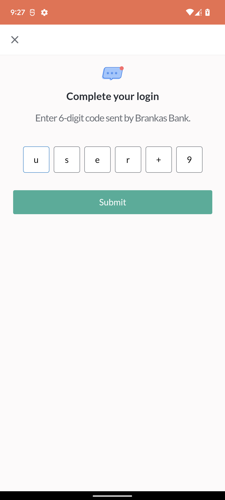

# Statement Tap SDK for Android
***
*Version:* 4.2.0
***


## Table of Contents
  1. [About SDK](#about-sdk)
  2. [Minimum Requirements](#minimum-requirements)
  3. [Installation](#installation)
  4. [Initialization](#initialization)
  5. [Usage](#usage)
  6. [Statement List Download](#statement-list-download)
  7. [App Tracking and Privacy Changes](#app-tracking-privacy)

***

<a name="about-sdk">
## About SDK
</a>

### What is Statement Tap SDK?
- **Statement Tap SDK** is a development kit used to launch Tap Web Application inside an embedded WebView via **Statement API** (Application Programming Interface) for **Transaction History Retrieval**. 
- This kit helps mobile developers to integrate with Brankas Statement API Services with less setup needed and code implementation. 
- The SDK provides list of banks available for Transaction History Retrieval
- The SDK also provides the **Transaction** list object after transaction history retrieval has been initiated
- The SDK also gives an option to download the transaction history in CSV format

### Benefits of Using Statement Tap SDK
- **The SDK provides everything that is needed**<br/> No need to setup HTTPURLConnection or any similar third-party library. Everything is already built within the SDK. Just call the appropriate functions and the needed data will be returned.
- **The SDK provides User Interface**<br/>No need to create a WebView or launch an external Mobile Web Browser. The SDK already provides an embedded WebView wherein built-in functions are done to detect successful or failed transactions
- **The SDK provides freedom and flexibility.**<br/>The developer has the option not to use the embedded WebView and create his own: the checkout URL can be used.<br/>The embedded WebView can be launched via another **Activity** or be embedded inside a **Fragment**
- **The SDK provides convenience.**<br/>The needed API Services are called sequentially and polling of retrieval is handled internally. The Balance Account List object will be returned automatically after Tap Web Application Session.
- **The SDK provides greater speed.**<br/>The SDK uses gRPC (Remote Procedure Call) mechanism to communicate with the API Services faster. Using gRPC is roughly 7 times faster than REST (Representational State Transfer) when receiving data and roughly 10 times faster when sending data

### How to Use 'Tap'?
- Just follow these easy steps to perform **Transaction History Retrieval**
1. Click **Continue** to accept terms and conditions regarding Privacy Policy in the Consent Page<br/><br/><br/><br/>
2. Select the desired bank in the Bank Selector Page and click **Continue**<br/><br/><br/><br/>
3. Enter the login credentials and click **Submit** <br/><br/><br/><br/>
4. Enter the OTP (One-time Password) and click **Submit** <br/><br/><br/><br/>
5. Wait until the transaction history retrieval is finished. Success Page will be shown subsequently.<br/><br/><br/><br/>

<a name="minimum-requirements">
## Minimum Requirements
</a>

1. **Android Studio 3.0** but preferably the latest version
2. Minimum Android SDK: **API 21** or **Android 5.0**
3. Target SDK Version: at least **API 34** or **Android 14** 

## Installation

This set of instructions assumes that the IDE being used is Android Studio

1. In your project build.gradle, ensure to add the URL of the repository under maven. Here is a sample:
	```
	allprojects {
    	repositories {
        		maven {
            		url = "https://maven.pkg.github.com/brankas/core-sdk-android"
            		credentials {
                			username = ""
                			password = ""
            		}
        		}
    	}
}
	```
**NOTE: You can use any GitHub Account in filling up the credentials**

2. In your app build.gradle file, add this line inside the dependencies configuration: **implementation "com.brankas.tap:statement-tap:4.2.0"** to set the SDK as a dependency for the application. This should look like:

	```gradle
	dependencies {
    	implementation "com.brankas.tap:statement-tap:4.2.0"
	}


3. Inside the the same dependencies configuration, insert the following lines to enable gRPC Connections which are needed by the SDK. Also, include RxJava for asynchronous listening to the results. **Do not forget to include compileOptions and kotlinOptions to use Java 8**

	```gradle
	dependencies {
 		implementation 'com.google.protobuf:protobuf-javalite:3.20.0'
    		implementation 'io.grpc:grpc-okhttp:1.51.1'
    		implementation('io.grpc:grpc-protobuf-lite:1.51.1') {
        			exclude group: 'com.google.protobuf'
    		}
    		implementation 'io.grpc:grpc-stub:1.51.1'
			implementation 'io.reactivex.rxjava3:rxjava:3.1.6'
    		implementation 'io.reactivex.rxjava3:rxandroid:3.0.2'
			//implementation "org.jetbrains.kotlinx:kotlinx-coroutines-rx2:$kotlin_coroutines_version"
			implementation 'org.jetbrains.kotlinx:kotlinx-serialization-json:1.3.2'
	}

	compileOptions {
        		sourceCompatibility JavaVersion.VERSION_1_8
        		targetCompatibility JavaVersion.VERSION_1_8
    	}

    	kotlinOptions {
        		jvmTarget = "1.8"
    	}
	```
**NOTE: To mix coroutines and RxJava in the same project, include the optional dependency commented out**

4. In the plugins section, add these:

	````gradle
plugins {
    	id 'com.android.application'
    	id 'kotlin-android'
    	id 'kotlin-parcelize'
    	id 'org.jetbrains.kotlin.plugin.serialization' version '1.6.10'
}
	````

5. In the defaultConfig section, ensure that the target SDK Version is **API 34**. There might be a manifest merger conflict that will arise if the target version is not met.

	````gradle
defaultConfig {
		targetSdkVersion 34
}
	````


6. Add the permission **android.permission.INTERNET** in your **AndroidManifest.xml** file to allow your application to access Internet, which is required to use Tap API Services.

    ```xml
    <uses-permission android:name="android.permission.INTERNET" />
    ```
    
## Initialization

1. Call the initialize function from the StatementTapSDK and pass the context and api key provided by Brankas.<br/><br/>**Java:**

	```java

	import as.brank.sdk.tap.statement.StatementTapSDK;

	StatementTapSDK.INSTANCE.initialize(context, apiKey, null, false);

	```

	**Kotlin:**

	```kotlin

	import `as`.brank.sdk.tap.statement.StatementTapSDK

	StatementTapSDK.initialize(context, apiKey, null, false)

	```
***NOTE:*** To use the **Sandbox** environment, set the optional **isDebug** option to **true**

2. The checkout function can now be called once the initialize function has been called.

## Usage

The SDK has a checkout function wherein it responds with a redirect url used to launch the Tap web application. An option is given either to use the url manually (via **retrieveCheckoutURL()** function) or let the SDK launch it through its internal WebView.

In order to use the checkout function, a **StatementTapRequest** is needed to be created and be passed. It has the following details:

1. **country** - refers to the country of origin of the bank you wanted to do statement retrieval with. There are three countries currently supported: *Philippines (PH)*, *Indonesia (ID)* and *Thailand (TH)*

2. **bankCodes** - refers to the list of banks to be shown within the Tap Web Application. If *null* value is passed, the SDK automatically fills up all the available banks depending on the country passed

3. **externalId** - refers to the identifier passed to track the request

4. **successURL** - refers to the URL where the user will be redirected to after a successful statement retrieval

5. **failURL** - refers to the URL where the user will be redirected to after a failed statement retrieval

6. **organizationName** - refers to the name of the organization that will be displayed while doing statement retrieval

7. **redirectDuration** - refers to the time in seconds when the user should be redirected upon finishing statement retrieval. The default value is *60 seconds*.

8. **dismissalDialog** - pertains to the showing of alert dialog when closing the WebView. It consists of **message**, **positiveButtonText** and **negativeButtonText**. Just set this value to *null** to remove the alert dialog when closing the application.

9. **statementRetrievalRequest** - pertains to the statement retrieval after Tap Web Session. **startDate** and **endDate** can be configured to retrieve transactions within date range

10. **includeBalance** - refers to the inclusion of balance within statement retrieval; default value is false

11. **hasPdfUpload** - refers to the inclusion of uploading of PDF File via Tap Web App

Here is a sample on how to use it and call:

<br/><br/> **Kotlin:**

```kotlin

import `as`.brank.sdk.tap.statement.StatementTapSDK
import `as`.brank.sdk.core.CoreError
import `as`.brank.sdk.tap.CoreListener
import tap.model.BankCode
import tap.model.Country
import tap.request.statement.StatementTapRequest
import tap.model.statement.StatementResponse
import tap.model.Reference

val request = StatementTapRequest.Builder()
            .country(Country.PH)
            .externalId("External ID")
            .successURL("https://google.com")
            .failURL("https://hello.com")
            .organizationName("Organization Name")

StatementTapSDK.checkout(this, request.build(), object: CoreListener<String>() {

        override fun onResult(data: String?, error: CoreError?) {
                println("DATA: "+data)
        }

}, 3000, false, true);3.1.23.1.2

    override fun onActivityResult(requestCode: Int, resultCode: Int, data: Intent?) {
        super.onActivityResult(requestCode, resultCode, data)
        if(requestCode == 2000) {
            if(resultCode == RESULT_OK) {
                val statementResponse = data?.getParcelableExtra<Reference<StatementResponse>>(
                    StatementTapSDK.STATEMENTS)
                val statementId = statementResponse?.get?.statementId
                Toast.makeText(this,
                    "Statement Retrieval Successful! Here is the statement id: $statementId",
                    Toast.LENGTH_SHORT).show()
            }
            else {
                val error = data?.getStringExtra(StatementTapSDK.ERROR)
                val errorCode = data?.getStringExtra(StatementTapSDK.ERROR_CODE)
                Toast.makeText(this, "$error ($errorCode)", Toast.LENGTH_LONG).show()
            }
        }
	}
```

<br/><br/> **Java:**

```java

import as.brank.sdk.tap.statement.StatementTapSDK;
import as.brank.sdk.core.CoreError;
import as.brank.sdk.tap.CoreListener;
import tap.model.BankCode;
import tap.model.Country;
import tap.request.statement.StatementTapRequest;
import tap.model.statement.StatementResponse;
import tap.model.Reference;

StatementTapRequest.Builder request=new StatementTapRequest.Builder()
        .country(Country.PH)
        .externalId("External ID")
        .successURL("https://google.com")
        .failURL("https://hello.com")
        .organizationName("Organization Name");

        StatementTapSDK.INSTANCE.checkout(this, request.build(),new CoreListener<String>(){
		@Override
		public void onResult(String data,CoreError error){
        		System.out.println("DATA: "+data);
        	}
        }, 3000, false, true);

@Override
public void onActivityResult(int requestCode,int resultCode,Intent data){
        super.onActivityResult(requestCode, resultCode, data);
        if(requestCode == 3000){
        	if(resultCode == RESULT_OK){
        		StatementResponse statementResponse = data.getParcelableExtra.getParcelableExtra<Reference<StatementResponse>>(
                    StatementTapSDK.STATEMENTS)
        		String statementId = statementResponse.get().statementId;
        		Toast.makeText(this, "Statement Retrieval Successful! Here is the statement id: "+statementId,
        		Toast.LENGTH_SHORT).show();
        	}
        	else{
        		String error = data.getStringExtra(StatementTapSDK.ERROR);
        		String errorCode = data.getStringExtra(StatementTapSDK.ERROR_CODE);
        		Toast.makeText(this, error+" "+errorCode, Toast.LENGTH_LONG).show();
        	}
        }
}
```


***NOTES:***

The **isAutoConsent** in the **checkout** function is set to false by default. To enable its usage, just set the 2nd to the last parameter to true

The **useRememberMe** in the **checkout** function is set to false by default. To enable the usage of Remember Me inside the Tap Web Application, just pass false to the last parameter in the checkout function

The **actionBarText** in the **checkout** function is set to null by default - thus, the ActionBar gets hidden. To show it, just pass a String to it

The **showBackButton** in the **checkout** function is set to true by default. To hide the back button, just set the value to false

<a name="statement-list-download">
## Statement List Download
</a>
1. Call the **initDownload()** function inside the **onCreate()** function of the Activity
<br/><br/> **Java:**

	```java
	import as.brank.sdk.tap.statement.StatementTapSDK;

	@Override
	public void onCreate(Bundle savedInstanceState) {
		StatementTapSDK.INSTANCE.initDownload(this);
	}

	```

	**Kotlin:**

	```kotlin
	import `as`.brank.sdk.tap.statement.StatementTapSDK

	override fun onCreate(savedInstanceState: Bundle?) {
		StatementTapSDK.initDownload(this)
	}

	```
***NOTE:***  Call the **initDownload()** function in **onCreate() ONLY** to avoid any crash pertaining to register

2. Call **downloadStatement()** function to initiate the downloading of the list of statements in CSV format. Remember to pass the **Statement ID** returned from the previous section [Usage](#usage)
<br/><br/> **Java:**

	```java

	import as.brank.sdk.tap.statement.StatementTapSDK;
	import as.brank.sdk.core.CoreError;
	import as.brank.sdk.core.CoreListener;

    StatementTapSDK.INSTANCE.downloadStatement(this, "STATEMENT_ID", new CoreListener<Pair<String, byte[]>>() {
    	@Override
    	public void onResult(Pair<String, byte[]> data, CoreError error) {
    		if(data != null)
            		System.out.println("STATEMENT PATH: "+data.getFirst());
            }
    }, true);

	```

	**Kotlin:**

	```kotlin

	import `as`.brank.sdk.tap.statement.StatementTapSDK
	import `as`.brank.sdk.core.CoreError
	import `as`.brank.sdk.core.CoreListener

    StatementTapSDK.downloadStatement(this, "STATEMENT_ID", object: CoreListener<Pair<String?, ByteArray>> {
    	override fun onResult(data: String?, error: CoreError?) {
    		data?.let {
    			println("STATEMENT PATH: "+data.first)	
    		}
            }
    }, true)

	```

***NOTE:*** **data** returned in the **onResult()** function pertains to the directory or URI path where the file has been saved to and the statement data in byte array. Thus, if it is null, an **error** occurred. If **first** in pair is null, the file is not saved to any directory in the mobile phone. Also, there is an option to save the CSV or not; just update **enableSaving** parameter.

<a name="app-tracking-privacy">
## App Tracking and Privacy Changes
</a>

### What is added?

Starting v4.0 of Statement Tap SDK, a new feature has been added internally - **logging of Tap Web Flow**. This feature helps Brankas to track the flow of a transaction while performing a **Statement Retrieval** within Tap Web App. This will aid in pointing out some errors within transactions and eventually improve the overall experience.

### Can the logging feature be turned off?
By default, the logging feature is enabled. There is an option to turn off the logging feature by changing the value of **isLoggingEnabled** within the **initialize()** function. Below is the sample call:

<br/><br/>**Java:**

```java

import as.brank.sdk.tap.statement.StatementTapSDK;

StatementTapSDK.INSTANCE.initialize(context, apiKey, null, false, false);
```

<br/><br/> **Kotlin:**

```kotlin

import `as`.brank.sdk.tap.statement.StatementTapSDK

StatementTapSDK.initialize(context, apiKey, null, false, false)
```


